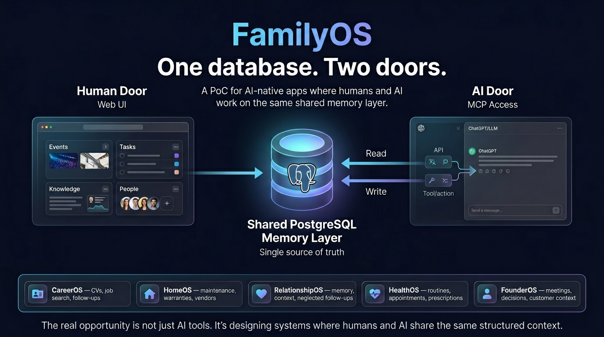

# FamilyOS

FamilyOS is a private AI-native family operating system for home use, built on one shared Supabase Postgres database.

It is designed around a simple idea: one database, two doors.

- a calm web app for humans
- a structured MCP-ready data layer for AI



FamilyOS is built and shared by [Alok Sharma](https://www.linkedin.com/in/kingalok-sharma/).

Related post:
- [FamilyOS on LinkedIn](https://www.linkedin.com/posts/kingalok-sharma_ai-contextengineering-nextjs-activity-7439756792647139330-kfIn?utm_source=share&utm_medium=member_desktop&rcm=ACoAAA4CjiwBGtCwcvfvVNus8F1u7V853hDlKAM)

## One Database, Two Doors

- Web access: the Next.js app is the human-facing door for signed-in browser use.
- MCP access: an MCP-capable AI client can connect to the same Supabase project and operate on the same FamilyOS data.

The database stays the source of truth. The web app and MCP clients are just two ways into the same system.

## What Works Now

- Supabase email/password login
- Protected app routes
- Row Level Security on core FamilyOS tables
- Shared Supabase-backed data for:
  - `people`
  - `events`
  - `tasks`
  - `knowledge_items`
- MCP-friendly read views and write helper functions

## Authentication

FamilyOS uses Supabase Auth with email/password only.

How it works in simple terms:

- if you are not signed in, private app routes redirect to `/login`
- after a successful login, you are redirected back to the page you originally requested
- if you are already signed in and visit `/login`, you are redirected into the app
- logout clears the Supabase session and sends you back to `/login`

Protected routes include:

- `/`
- `/people`
- `/events`
- `/tasks`
- `/knowledge`

Public access is limited to:

- `/login`
- static assets
- future auth callback routes if added later

## RLS

FamilyOS uses Supabase Row Level Security to keep access simple and safe for now.

Current model:

- `anon` users are blocked
- `authenticated` users can read and write FamilyOS records
- there is no per-user row ownership logic yet

In plain English: you must be signed in, and once signed in, you can use the current private FamilyOS app normally.

## Web Access vs MCP Access

These are separate authentication paths:

- Web access uses browser login through Supabase Auth
- MCP access uses the MCP client’s own connection/auth flow to Supabase MCP

Signing into the FamilyOS website does not automatically sign an MCP client into Supabase MCP, and connecting MCP does not automatically sign you into the browser app.

## Local Run

1. Create local env vars:

```bash
cp .env.example .env.local
```

2. Set at minimum:

```bash
NEXT_PUBLIC_SUPABASE_URL=...
NEXT_PUBLIC_SUPABASE_PUBLISHABLE_KEY=...
DATABASE_URL=...
```

3. Install dependencies:

```bash
npm install
```

4. Start the app:

```bash
npm run dev
```

5. Open [http://localhost:3000](http://localhost:3000)

## Required Environment Variables

For the web app:

- `NEXT_PUBLIC_SUPABASE_URL`
- `NEXT_PUBLIC_SUPABASE_PUBLISHABLE_KEY`

Useful for local admin/agent work:

- `DATABASE_URL`

Optional MCP-related values:

- `SUPABASE_PROJECT_REF`
- `SUPABASE_ACCESS_TOKEN`

## Vercel Deployment

FamilyOS is Vercel-friendly.

Required Vercel env vars:

- `NEXT_PUBLIC_SUPABASE_URL`
- `NEXT_PUBLIC_SUPABASE_PUBLISHABLE_KEY`

Deployment checklist:

1. Push the latest commit to GitHub.
2. In Vercel, confirm the project points at the FamilyOS repo.
3. In Vercel project settings, add or verify:
   - `NEXT_PUBLIC_SUPABASE_URL`
   - `NEXT_PUBLIC_SUPABASE_PUBLISHABLE_KEY`
4. Redeploy the app.
5. Test login, logout, and one protected route such as `/tasks`.

Detailed deploy checklist:

- [`docs/vercel-deployment.md`](/Users/Alok_Sharma/Documents/myrepo/FamilyOS/docs/vercel-deployment.md)

## Supabase Setup For `myworld`

Manual Supabase steps:

1. Enable email/password auth.
2. Create your Supabase Auth user.
3. Keep RLS enabled on FamilyOS tables.
4. Apply the FamilyOS migrations in `supabase/migrations`.
5. Verify authenticated policies exist for:
   - `people`
   - `events`
   - `tasks`
   - `knowledge_items`

## MCP

FamilyOS is prepared for Supabase MCP without adding a custom MCP server.

- Use the hosted Supabase MCP endpoint against your `myworld` project.
- Browser auth and MCP auth are separate.
- Prefer these read helpers:
  - `upcoming_events_view`
  - `open_tasks_view`
  - `recent_knowledge_items_view`
- Prefer these write helpers:
  - `create_task(...)`
  - `create_event(...)`
  - `save_knowledge_item(...)`
  - `update_task_status(...)`

Detailed MCP notes:

- [`docs/mcp-setup.md`](/Users/Alok_Sharma/Documents/myrepo/FamilyOS/docs/mcp-setup.md)
- [`docs/chatgpt-familyos-context.md`](/Users/Alok_Sharma/Documents/myrepo/FamilyOS/docs/chatgpt-familyos-context.md)

## Retest After Auth And RLS Changes

Browser checks:

1. Open the app while signed out and confirm private routes redirect to `/login`.
2. Sign in with your Supabase email/password user.
3. Confirm you land on the originally requested page after login.
4. Open:
   - `/`
   - `/people`
   - `/events`
   - `/tasks`
   - `/knowledge`
   - `/search?q=school`
5. Create or edit one record in each domain you actively use.
6. Log out and confirm you are returned to `/login`.

MCP checks:

1. Re-open your MCP-enabled chat and verify the FamilyOS Supabase connection is still attached.
2. Re-test one read:
   - open tasks via `open_tasks_view`
3. Re-test one write:
   - create a task
4. Re-test one update:
   - update a task status

MCP note:

- RLS policy changes do not usually require a new browser login to the website.
- MCP is likely only partially affected: existing MCP setup should continue to work if it authenticates as an `authenticated` Supabase user, but you may need to reconnect or re-authorize the MCP client if it cached an older session or now hits permission errors.
- If MCP starts failing after the RLS migration, reconnect the MCP app first before changing policies again.

## Key Commands

Frontend:

```bash
npm install
npm run dev
npm run build
```

Supabase:

```bash
supabase db push
supabase db reset
```

Python scaffold:

```bash
cd agent
uv sync
uv run familyos-agent list-open-tasks
```
